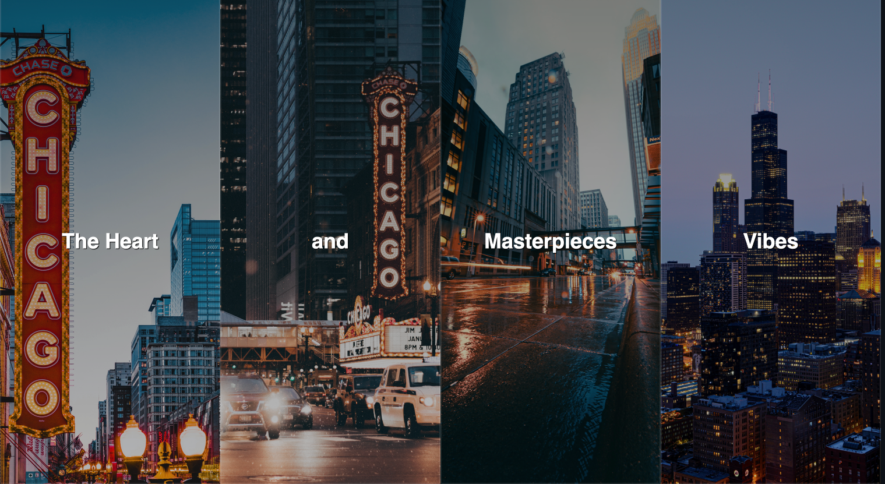

# Flex-Panel-Display-HTML-CSS--JavaScript
This project involves creating an interactive panel display using JavaScript and utilizing flexbox for layout and animation. The panel display consists of multiple panels that can be clicked to expand and reveal hidden content.

# How to Use:

-Launch the panel display project in a web browser.
-You will see a set of panels displayed vertically on the page.
-Each panel has a header and hidden content.
-Click on a panel header to expand it.
-The expanded panel will smoothly slide open and reveal its content.
-Click on the expanded panel header again to collapse it.
-The collapsed panel will smoothly slide closed and hide its content.
-You can click on multiple panels to expand or collapse them simultaneously.

# Technologies Used:

JavaScript Concepts Used:
- Event handling: Event listeners are added to the panel headers to respond to user clicks.
- DOM manipulation: The querySelector and classList methods are used to select and modify elements in the DOM.
- CSS manipulation: JavaScript adds or removes CSS classes to trigger flexbox transitions and animations.
- Conditional statements: Conditional statements are used to check the current state of a panel and determine the appropriate action to take (expand or collapse).

  

The flex panel display project demonstrates how JavaScript can be used to create interactive and dynamic web experiences. By combining JavaScript with flexbox, the project provides an intuitive and visually appealing way to reveal hidden content in a smooth and engaging manner.
